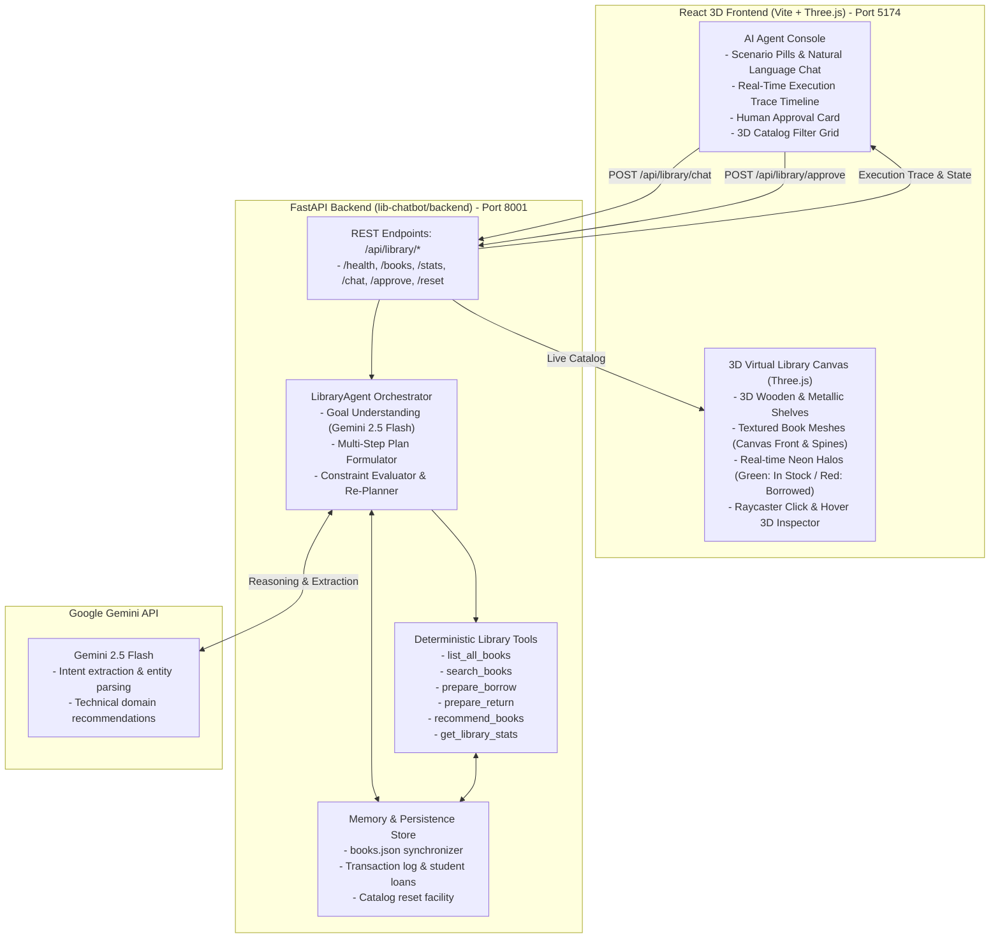
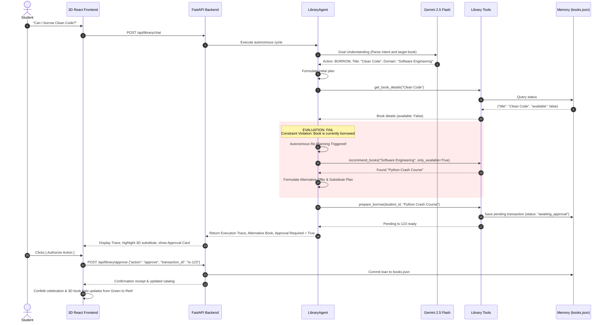

# CMRIT Autonomous 3D Library Agent (`lib-chatbot`)

A state-of-the-art **Autonomous Library Agent with an Interactive 3D Virtual Library Frontend** built to demonstrate the full Agentic AI lifecycle: **Goal Understanding, Planning, Reasoning, Tool Selection, Tool Execution, Observation, Evaluation (Constraint Checking), Autonomous Re-Planning, and Human-in-the-Loop Authorization**.

---

## 1. Project Overview

The CMRIT Autonomous Library Agent manages technical library archives through natural conversation and visual 3D interaction. When students ask to borrow or inspect books, the agent:
1. Understands student intent (e.g. *"Can I borrow Clean Code?"*).
2. Verifies catalog inventory and constraint rules (e.g. book availability).
3. If an item is borrowed (**Constraint Violation / Failure Scenario**), the agent **autonomously re-plans** by searching for and proposing available substitutes in the same technical domain.
4. Enforces the **Human-in-the-Loop Safety Rule**: no inventory alteration occurs until explicit authorization is granted by the student/librarian.
5. Reflects all actions live in a **3D Virtual Bookshelf** rendered with Three.js.

---

## 2. Architecture



---

## 3. Autonomous Lifecycle



---

## 4. 3D Virtual Library Features

- **Procedural 3D Books**: Each book from `books.json` is generated with realistic dimensions, rounded spine, embossed vertical titles, and category-themed palette textures.
- **Real-Time Availability Auras**:
  - Available books project a pulsing **emerald green halo** and glowing top beacon pin.
  - Checked-out books emit a **crimson status halo**.
- **Interactive Raycasting**:
  - Hovering a book smoothly slides it forward from the shelf, illuminates it with rim-light, and displays a floating 3D HUD card.
  - Clicking a book smoothly glides the camera and opens the **3D Book Inspector**.
- **Orbit Controls & View Presets**:
  - Full 360° mouse drag orbit, zoom, and preset angle buttons ("Shelf View", "Studio Angle", "Tactical Top").

---

## 5. Library Tools

| Tool | Parameters | Description |
| :--- | :--- | :--- |
| `list_all_books` | None | Returns the full catalog with availability |
| `search_books` | `query` | Searches by title, author, or category keyword |
| `get_book_details` | `title` | Retrieves detailed metadata and shelf bay position |
| `prepare_borrow` | `student_id`, `title` | Verifies availability, checks loan quota (max 3), creates pending checkout record |
| `prepare_return` | `student_id`, `title` | Verifies book is borrowed, creates pending return record |
| `recommend_books`| `category_or_topic` | Recommends books based on topic or related technical category |
| `get_library_stats`| None | Returns total books, available count, borrowed count, and category distributions |

---

## 6. How to Run

### Backend (FastAPI on Port 8001)

From repository root (`chatbot/`):

```bash
.\.venv\Scripts\python.exe -m uvicorn app.main:app --app-dir lib-chatbot/backend --port 8001 --reload
```

Interactive Swagger Docs available at: [http://127.0.0.1:8001/docs](http://127.0.0.1:8001/docs)

Run automated backend tests:
```bash
.\.venv\Scripts\python.exe lib-chatbot/backend/test_agent.py
```

### Frontend (React + Vite + Three.js on Port 5174)

```bash
Push-Location lib-chatbot/frontend
npm run dev
Pop-Location
```

The 3D Virtual Library will be live at: [http://localhost:5174/](http://localhost:5174/)
