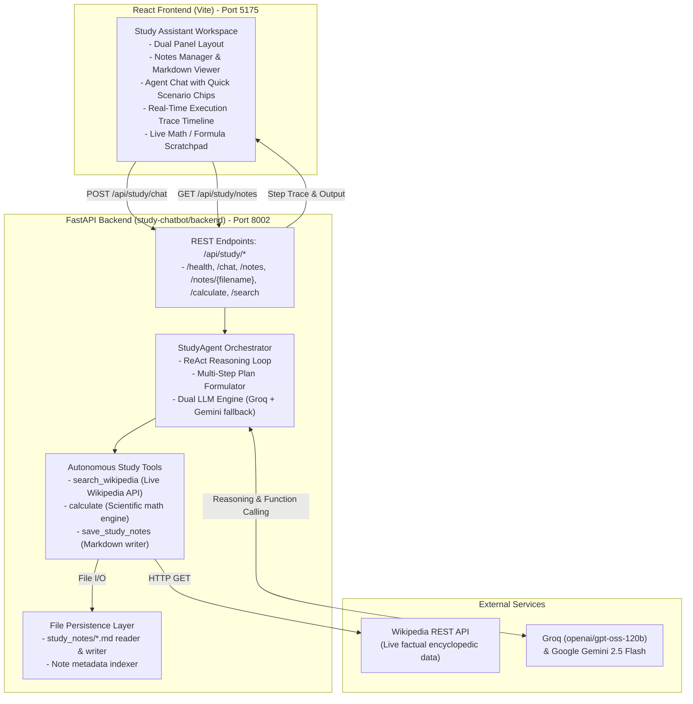
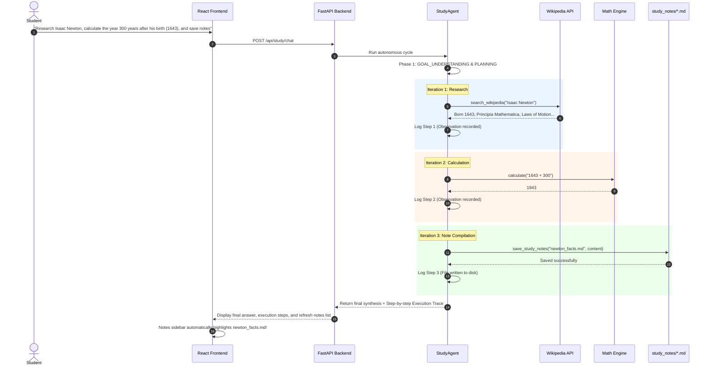

# Autonomous Agentic Study Assistant (`study-chatbot`)

A high-performance **Autonomous Agentic Study Assistant** built with a **FastAPI backend** and a modern **React (Vite) frontend**. Unlike conventional passive chatbots that only generate conversational text, this agent can autonomously plan, retrieve live factual knowledge from Wikipedia, solve complex scientific formulas without hallucinating, and compile persistent markdown revision guides directly to disk.

---

## 1. Project Overview

The Autonomous Study Assistant operates as a dedicated pair-learning agent. When given a complex study goal (e.g. *"Research Isaac Newton on Wikipedia, calculate what year it was 300 years after his birth (1643), and save a 3-bullet revision note to newton_facts.md"*), the agent:
1. **Understands & Plans**: Formulates the required sequence of research, computation, and file persistence.
2. **Executes External Tools**:
   - 🔍 **`search_wikipedia`**: Fetches encyclopedic summaries from Wikipedia's live REST API.
   - 🧮 **`calculate`**: Evaluates mathematical and scientific formulas with absolute precision (supporting trigonometry, logarithms, powers, and roots).
   - 📝 **`save_study_notes`**: Compiles structured markdown revision guides into `study_notes/`.
3. **Presents Live Trace**: Logs every reasoning step, tool call, and observation on an interactive visual timeline.

---

## 2. Architecture



---

## 3. Agent Lifecycle



---

## 4. Registered Tools

| Tool | Parameters | Description |
| :--- | :--- | :--- |
| `search_wikipedia` | `query: str` | Queries live Wikipedia REST API for verified factual knowledge |
| `calculate` | `expression: str` | Evaluates math and physics formulas without model drift or hallucination |
| `save_study_notes` | `filename: str, content: str` | Compiles and writes formatted markdown revision guides directly to `study_notes/` |
| `list_study_notes` | None | Returns index of all saved notes with title, preview, and size |
| `get_study_note` | `filename: str` | Reads full content of a note from disk |

---

## 5. How to Run

### Backend (FastAPI on Port 8002)

From the repository root (`chatbot/`):

```bash
.\.venv\Scripts\python.exe -m uvicorn app.main:app --app-dir study-chatbot/backend --port 8002 --reload
```

Interactive Swagger Docs available at: [http://127.0.0.1:8002/docs](http://127.0.0.1:8002/docs)

Run automated backend tests:
```bash
.\.venv\Scripts\python.exe study-chatbot/backend/test_agent.py
```

### Frontend (React + Vite on Port 5175)

```bash
Push-Location study-chatbot/frontend
npm run dev
Pop-Location
```

The Study Assistant will be live at: [http://localhost:5175/](http://localhost:5175/)
