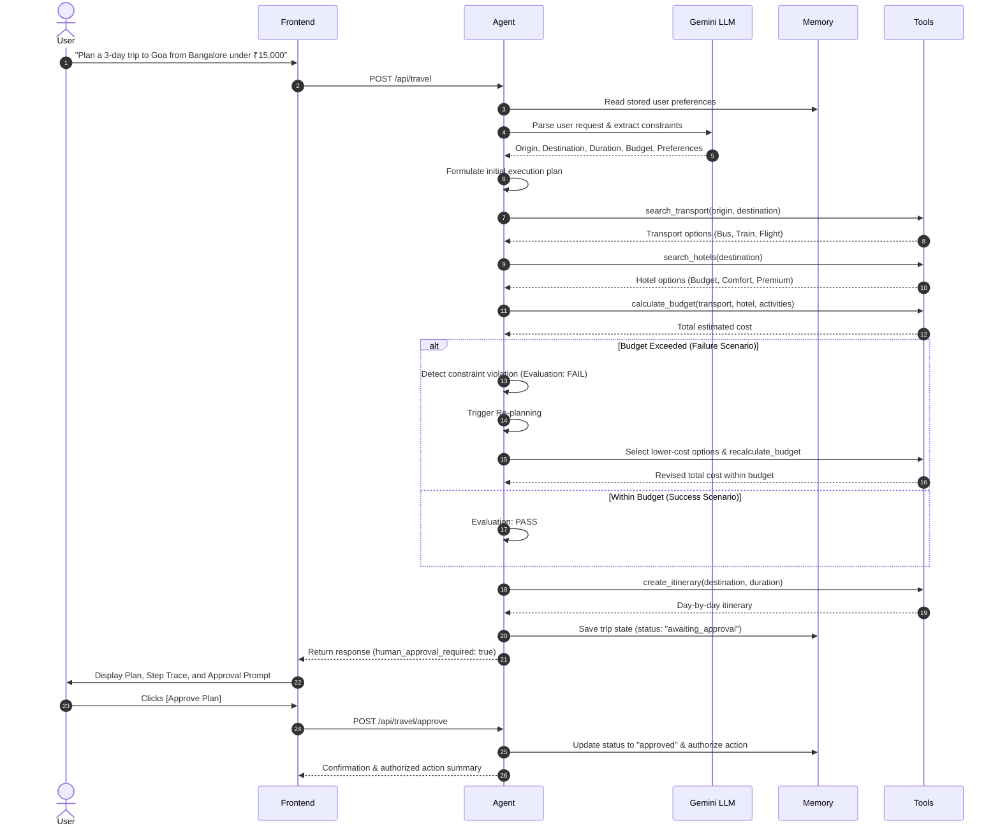

# Mini Autonomous Travel Agent

A lightweight, clean implementation of an **Autonomous Travel Agent** built for a classroom activity demonstrating the core concepts of agentic AI: **Goal Understanding, Planning, Tool Selection, Action, Observation, Evaluation, Re-Planning, and Human-in-the-Loop Approval**.

---

## 1. Project Overview

The Mini Autonomous Travel Agent takes natural language travel requests (such as *"Plan a 3-day trip to Goa from Bangalore under ₹15,000"*), formulates a multi-step plan, invokes deterministic travel tools, evaluates results against budget constraints, autonomously re-plans if constraints are violated, and halts for human authorization before executing any booking action.

This project demonstrates the complete autonomous agent lifecycle with a clean separation of concerns:
- **LLM (Gemini API via official `google-genai` SDK)**: Goal extraction, intent understanding, reasoning summaries, and itinerary generation.
- **Python Backend (FastAPI)**: Deterministic tool execution, budget arithmetic, constraint checking, state management, and human approval gating.
- **React Frontend (Vite)**: Clean UI displaying real-time lifecycle trace, step logs, re-planning alerts, final plan card, and human approval controls.

---

## 2. Architecture

```mermaid
flowchart TD
    subgraph Frontend [React Frontend (Vite)]
        UI[User Input & Scenario Selector]
        Trace[Lifecycle Step Trace & Timeline]
        PlanView[Final Plan Card & Cost Summary]
        ApprovalUI[Human Approval Bar]
    end

    subgraph Backend [FastAPI Backend]
        API[API Endpoints: /api/travel, /api/travel/approve]
        Agent[TravelAgent Orchestrator]
        Mem[(In-Memory State & Preferences)]
    end

    subgraph LLM [Google Gemini]
        Gemini[Gemini 2.5 Flash]
    end

    subgraph Tools [Deterministic Python Tools]
        T1[search_transport]
        T2[search_hotels]
        T3[calculate_budget]
        T4[create_itinerary]
    end

    UI -->|POST /api/travel| API
    API --> Agent
    Agent <-->|Goal Extraction & Reasoning| Gemini
    Agent <--> Mem
    Agent -->|Execute| Tools
    Agent -->|Return Execution Trace & Plan| API
    API --> Trace
    API --> PlanView
    ApprovalUI -->|POST /api/travel/approve| API
```

---

## 3. Agent Lifecycle

The agent executes through the following distinct lifecycle stages:



---

## 4. Folder Structure

```
travel-agent/
│
├── backend/
│   ├── app/
│   │   ├── __init__.py
│   │   ├── main.py          # FastAPI application & REST endpoints
│   │   ├── agent.py         # Single autonomous travel agent logic
│   │   ├── memory.py        # In-memory storage for preferences & trip state
│   │   ├── tools.py         # Deterministic mock travel tools
│   │   └── schemas.py       # Pydantic request/response models
│   │
│   ├── test_agent.py        # Automated test suite for scenarios & approval
│   ├── requirements.txt     # Python backend dependencies
│   └── .env.example         # Template for environment variables
│
├── frontend/
│   ├── src/
│   │   ├── App.jsx          # React UI with trace, plan, and approval buttons
│   │   ├── main.jsx         # React application entrypoint
│   │   └── index.css        # Clean styling and responsive layout
│   ├── index.html           # HTML template
│   ├── vite.config.js       # Vite build & proxy configuration
│   └── package.json         # Node.js dependencies & scripts
│
├── README.md                # Comprehensive project documentation
├── .env.example             # Root environment template
└── .gitignore               # Ignored files (node_modules, .env, __pycache__)
```

---

## 5. Tools

All tools are ordinary Python functions using mock travel data:

| Tool | Parameters | Description | Example Output |
| :--- | :--- | :--- | :--- |
| `search_transport` | `origin`, `destination` | Searches transport options | `{"options": [{"type": "Bus", "price": 1000}, {"type": "Train", "price": 1200}, {"type": "Flight", "price": 3500}]}` |
| `search_hotels` | `destination` | Searches accommodation tiers | `{"options": [{"name": "Budget Hotel", "price_per_night": 2000}, {"name": "Comfort Hotel", "price_per_night": 3000}, {"name": "Premium Hotel", "price_per_night": 5000}]}` |
| `calculate_budget` | `transport_cost`, `hotel_cost`, `activity_cost` | Deterministic cost arithmetic | `total_cost = transport + hotel + activities` |
| `create_itinerary` | `destination`, `duration` | Generates day-by-day itinerary | List of days with morning, afternoon, and evening activities |

---

## 6. Memory Design

Memory is implemented using a pure in-memory Python class (`TravelMemory`) without any external databases (no Redis, PostgreSQL, or vector DBs):

```python
{
  "preferences": {
    "preferred_transport": "train",
    "preferred_hotel_tier": "comfort"
  },
  "current_trip": {
    "trip_id": "trip-abc12345",
    "status": "awaiting_approval",
    "final_plan": { ... }
  },
  "trips": {
    "trip-abc12345": { ... }
  }
}
```

- **User Preferences**: Remembers preferences across runs (e.g. transport type or hotel tier).
- **Current Trip**: Tracks current execution state, constraints, budget, and authorization status.

---

## 7. Successful Execution Example (Scenario 1)

### Input
`"Plan a 3-day trip to Goa from Bangalore under ₹15,000"`

### Execution Flow
1. **Goal Understanding**: Extracted origin: Bangalore, destination: Goa, duration: 3 days, budget: ₹15,000.
2. **Planning**: Created multi-step execution plan.
3. **Action & Observation**: `search_transport` returned Bus (₹1,000), Train (₹1,200), Flight (₹3,500).
4. **Action & Observation**: `search_hotels` returned Budget (₹2,000/night), Comfort (₹3,000/night), Premium (₹5,000/night).
5. **Action & Evaluation**:
   - Transport: Train round-trip = ₹2,400
   - Hotel: Comfort Hotel (2 nights) = ₹6,000
   - Activities: 3 days = ₹3,000
   - Total Cost: ₹11,400
   - Constraint Check: ₹11,400 <= ₹15,000 (**PASS**)
6. **Itinerary Generation**: 3-day customized Goa itinerary.
7. **Human Approval**: Paused with status `awaiting_approval`.

---

## 8. Failure & Re-Planning Example (Scenario 2)

### Input
`"Plan a 3-day trip to Goa from Bangalore under ₹10,000 with flights"`

### Execution Flow
1. **Goal Understanding**: Extracted origin: Bangalore, destination: Goa, duration: 3 days, budget: ₹10,000, preferred transport: flight.
2. **Initial Option Selection**:
   - Flight round-trip: ₹7,000
   - Hotel (Comfort, 2 nights): ₹6,000
   - Activities (3 days): ₹3,000
   - Total Cost: ₹16,000
3. **Evaluation**:
   - **FAIL**: Cost ₹16,000 exceeds user budget of ₹10,000 by ₹6,000.
4. **Re-Planning Triggered**:
   - Agent notes violation: *"Initial plan cost of ₹16,000 exceeded the budget of ₹10,000."*
   - Agent autonomously searches for cheaper alternatives.
   - Evaluates lower-cost combinations: switches Flight to Train (₹2,400 round-trip) and Hotel to Budget Hotel (₹4,000 for 2 nights).
   - Recalculates total budget: ₹2,400 + ₹4,000 + ₹3,000 = ₹9,400.
   - Evaluation: **PASS** (₹9,400 <= ₹10,000).
5. **Final Plan**: Validated economical plan generated.
6. **Human Approval**: Paused with status `awaiting_approval`.

The execution trace clearly shows:
```
ACTION -> OBSERVATION -> EVALUATION (FAIL) -> RE-PLANNING -> NEW ACTION -> OBSERVATION -> EVALUATION (PASS) -> SUCCESS
```

---

## 9. Human-in-the-Loop Safety Rule

The agent **never** executes booking or financial actions autonomously:
1. The agent compiles the plan and verifies constraints.
2. The agent transitions to `awaiting_approval` and sets `human_approval_required = True`.
3. The user reviews the plan and clicks **[ Approve Plan ]** or **[ Reject Plan ]**.
4. Only upon explicit approval does the agent execute the authorized confirmation action.

---

## 10. Setup Instructions

### Prerequisites
- Python 3.10+
- Node.js 18+ and npm
- Gemini API Key

### Environment Setup
Create a `.env` file in the project root or backend folder:
```bash
GEMINI_API_KEY=your_actual_gemini_api_key_here
```

---

## 11. How to Run Backend

From the repository root (`chatbot/`):

```bash
# Using virtual environment
.venv\Scripts\python.exe -m uvicorn app.main:app --app-dir travel-agent/backend --port 8000 --reload
```

Or from `travel-agent/backend/`:

```bash
pip install -r requirements.txt
uvicorn app.main:app --port 8000 --reload
```

Backend will be live at: `http://127.0.0.1:8000`  
Interactive Swagger Docs at: `http://127.0.0.1:8000/docs`

To run the automated verification test:
```bash
.venv\Scripts\python.exe travel-agent/backend/test_agent.py
```

---

## 12. How to Run Frontend

From `travel-agent/frontend/`:

```bash
npm install
npm run dev
```

The frontend will start at: `http://localhost:5173`
